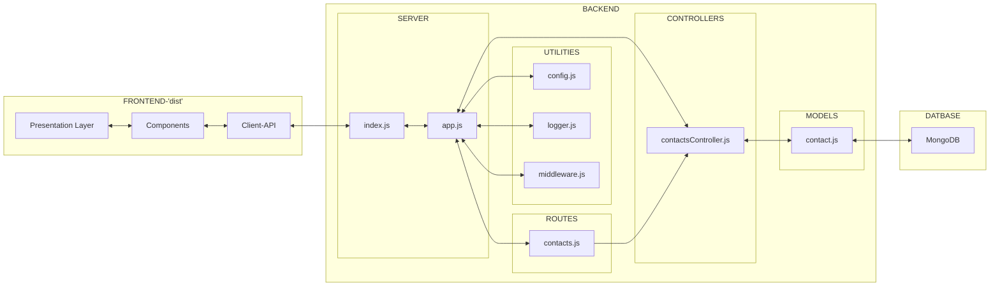

# Overview
- The entire course is of 14 Parts. Core course is 7 Parts.
- This repository consists of exercises from Part 3.
- Check [Parts 0 - 2](https://github.com/prak112/fullstack-open-core) 

# Part 3 - Programming a server with Node.js and Express
- [Deployed Phonebook application](https://fullstackopen-core-part3.onrender.com) on Render

| Exercises | Description |
| --- | --- |
| 3.1 to 3.8 | [Build REST API using Express](/index.js), [API testing using REST Client extension](/requests/), Middleware logging using `morgan` |
| 3.9 to 3.11 | Deploy backend using Render - [Deployed Phonebook app](https://fullstackopen-core-part3.onrender.com), Deploy frontend production build |
| 3.12 to 3.18 | MongoDB-mongoose [test deployment](/mongo.js), MongoDB-mongoose [setup with backend](/models/contact.js), [Error handling Middleware](/index.js) |
| 3.19 to 3.22 | [Input validation](/models/contact.js), Refactor to fix ESLint warnings |

## Project structure
- Recommended structure based on best practices for [server-app files seperation](https://dev.to/nermineslimane/always-separate-app-and-server-files--1nc7) ( *check comments for more useful info* ) 

```
    ├── index.js
    ├── app.js
    ├── controllers
    │   └── contactsController.js
    ├── dist
    │   └─-...
    ├── models
    │   └── contact.js
    |-- node_modules
    |   └─-...
    |-- requests
    |   └─-...
    |-- routes
    |   └─- contacts.js
    ├── utils
    │   ├── config.js
    │   ├── logger.js
    │   └── middleware.js
    |-- .env
    ├── .gitignore
    ├── eslint.config.mjs
    ├── package.json
    ├── README.md 
```
<hr>

### Interaction between modules



<hr>
<br>

